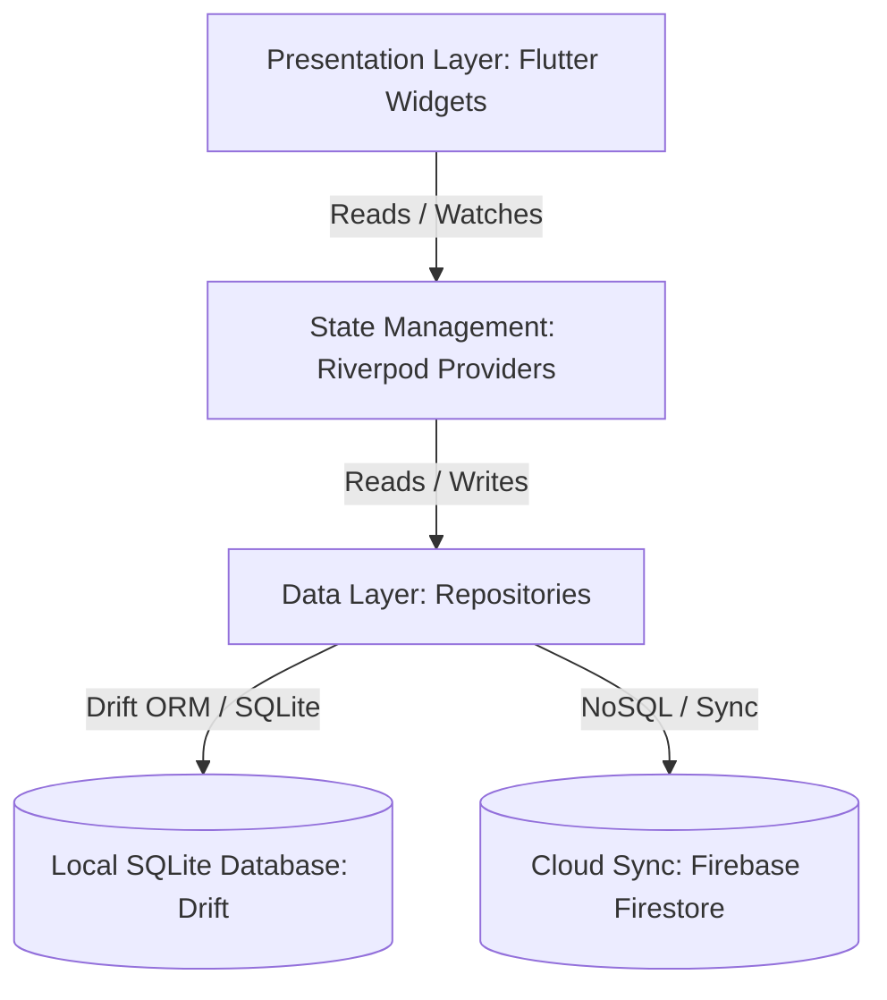
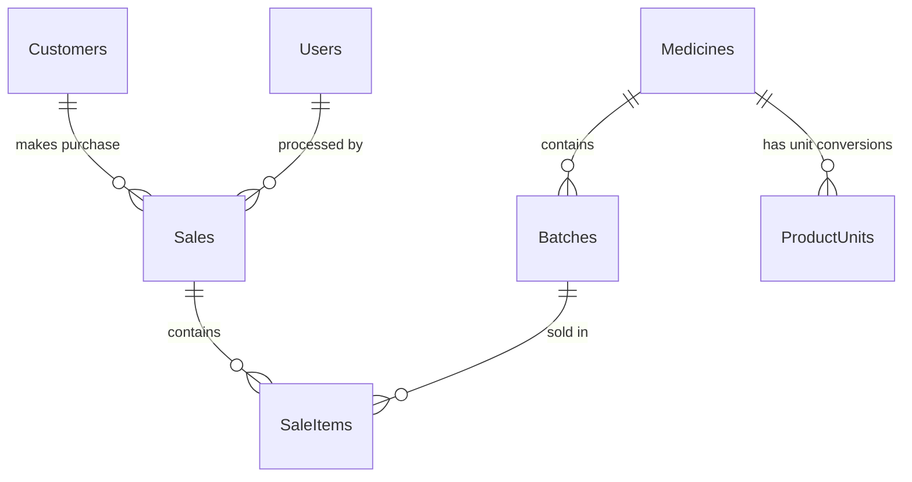
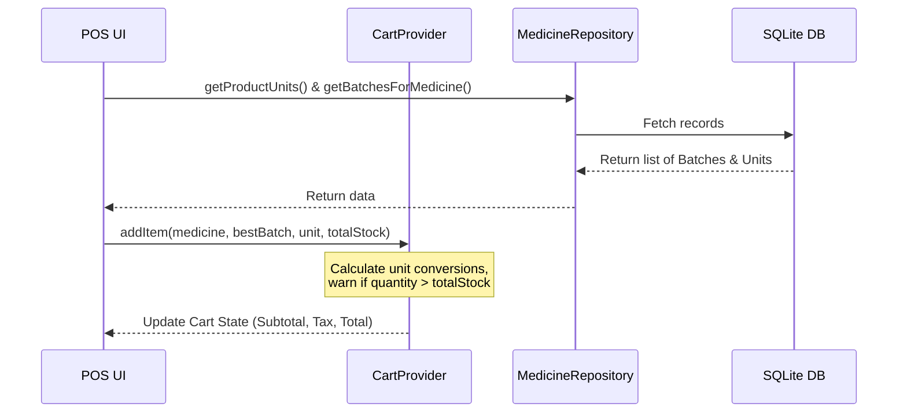

# Stockify: Architecture & Development Guide

Welcome to the comprehensive technical documentation and architecture guide for **Stockify**. This guide is designed to help you understand the database schemas, coding conventions, user interface layouts, data-flows, and how to implement new features.

---

## 1. High-Level Technical Architecture

Stockify uses a clean, unidirectional, offline-first architecture pattern:



### Key Technical Pillars:
*   **Presentation Layer (UI)**: Built with Flutter (Material 3). Features keyboard-driven inputs (`Shortcuts` & `Actions`) and responsive design (Desktop split-pane vs. Mobile tabbed views).
*   **State Management (Riverpod)**: Controls transient states, POS cart sessions, and the currently logged-in shop configuration.
*   **Database Layer (Drift / SQLite)**: Provides structured offline reliability. Implements relation mapping, custom database migrations, and reactive streams.
*   **Cloud Synchronization**: Integrates with Firebase Firestore to store global shop identity and subscription settings, with graceful in-memory fallbacks for offline testing.

---

## 2. Database Schema (Local SQLite / Drift)

The database schema is defined in [database.dart](file:///d:/Flutter%20Projects/Stockify/Stockify/lib/data/database/database.dart) and compiled using the code generator `database.g.dart`.



### Table Dictionary

#### A. Users
Manages cashiers, managers, and administrators:
*   `id` (Int, Auto-Increment Primary Key)
*   `username` (Text, Unique)
*   `passwordHash` (Text)
*   `role` (Text - Admin, Manager, Cashier)
*   `isActive` (Boolean, Default: True)

#### B. Settings
Local key-value store for app configuration, presets, and last-used form fields:
*   `key` (Text, Primary Key)
*   `value` (Text)

#### C. Categories
Organizes inventory catalog hierarchically:
*   `id` (Int, AutoIncrement Primary Key)
*   `name` (Text)
*   `parentId` (Int, Nullable - Self-referential FK to Categories)
*   `description` (Text, Nullable)
*   `imageUrl` (Text, Nullable)

#### D. Medicines (Products Table)
Stores product master data. Includes generic product fields added in v8:
*   `id` (Int, Auto-Increment Primary Key)
*   `name` (Text)
*   `code` (Text, Unique Barcode/SKU)
*   `mainCategory` (Text, Default: 'General')
*   `subCategory` (Text, Nullable)
*   `manufacturer` / `brand` (Text, Nullable)
*   `model` (Text, Nullable)
*   `genericName` (Text, Nullable - e.g. "Paracetamol")
*   `strength` (Text, Nullable - e.g. "500mg")
*   `dosageForm` (Text, Nullable - e.g. "Tablet")
*   `minStock` (Int, Default: 10 - threshold for alerts)
*   `baseUnitName` (Text, Default: 'Unit')

#### E. Batches
Handles inventory tracking. A single product can have multiple batches, allowing Stockify to track FIFO/FEFO rules, expiration dates, and variable cost structures:
*   `id` (Int, Auto-Increment Primary Key)
*   `medicineId` (Int, References Medicines.id)
*   `batchNumber` (Text)
*   `expiryDate` (DateTime)
*   `purchasePrice` (Real - wholesale cost)
*   `salePrice` (Real - base unit retail price)
*   `quantity` (Int - current stock available in base units)
*   `packSize` (Int, Default: 1)

#### F. ProductUnits
Maps unit conversion rules for inventory and POS checkout (e.g. Box = 10 units, Strip = 5 units):
*   `id` (Int, AutoIncrement Primary Key)
*   `medicineId` (Int, References Medicines.id)
*   `name` (Text - e.g. "Strip", "Box")
*   `conversionFactor` (Real - multiplier relative to base unit)
*   `salePrice` (Real - retail price for this unit)
*   `isBaseUnit` (Boolean)
*   `isDefaultSaleUnit` (Boolean)

#### G. Customers
Stores customer identity details:
*   `id` (Int, AutoIncrement Primary Key)
*   `name` (Text)
*   `phoneNumber` (Text, Nullable)

#### H. Sales
Orders header table capturing transaction sums and taxes:
*   `id` (Int, AutoIncrement Primary Key)
*   `invoiceNumber` (Text, Unique)
*   `customerId` (Int, Nullable, References Customers.id)
*   `date` (DateTime)
*   `subTotal` (Real)
*   `discount` (Real)
*   `tax` (Real)
*   `posFee` (Real)
*   `grandTotal` (Real)
*   `paymentMethod` (Text, Default: 'Cash')
*   `userId` (Int, Nullable, References Users.id)

#### I. SaleItems
Captures sold products snapshotting values at the time of purchase:
*   `id` (Int, AutoIncrement Primary Key)
*   `saleId` (Int, References Sales.id)
*   `batchId` (Int, References Batches.id)
*   `quantity` (Int)
*   `price` (Real - unit price at sale moment)
*   `total` (Real)
*   `unitName` (Text, Nullable)
*   `conversionFactor` (Real, Default: 1.0)

---

## 3. End-to-End Workflow & Code Analysis

### A. Point of Sale Cart & Stock Checking
The cart state resides in [cart_provider.dart](file:///d:/Flutter%20Projects/Stockify/Stockify/lib/ui/pos/cart_provider.dart) managed by Riverpod's `NotifierProvider`.



1.  **FEFO Batch Allocation**: When a product is added, the system fetches available stock batches, filters out those with `quantity <= 0`, and automatically selects the lot with the nearest expiration date (`expiryDate` sorted ascending) for the sale:
    ```dart
    final bestBatch = (List<Batch>.from(batches)..sort((a, b) => a.expiryDate.compareTo(b.expiryDate))).first;
    ```
2.  **Conversion Factor Logic**: Cart quantities are multiplied by their selected unit factor to calculate base-unit depletion:
    ```dart
    double get quantityInBaseUnits => quantity * selectedUnit.conversionFactor;
    ```
3.  **Automatic Pricing**: Subtotals, Discounts, Taxes (GST), and POS fees are dynamically computed depending on their configured types (`percent` or `fixed`):
    ```dart
    double get taxableAmount => subTotal - discountAmount;
    double get grandTotal => taxableAmount + gstAmount + taxAmount + posFeeAmount;
    ```

### B. Checkout Database Transaction
When the cashier clicks "Checkout" and confirms payment, [sale_repository.dart](file:///d:/Flutter%20Projects/Stockify/Stockify/lib/data/repositories/sale_repository.dart) runs a secure atomic SQLite transaction.

> [!IMPORTANT]
> The database changes are executed inside a Drift transaction block. If any step fails, the entire transaction rolls back, preventing dirty states where sales are recorded but stock is not deducted.

```dart
Future<int> createSale(SalesCompanion sale, List<SaleItemsCompanion> items) {
  return _db.transaction(() async {
    // 1. Insert order header
    final saleId = await _db.into(_db.sales).insert(sale);
    
    // 2. Process order items
    for (var item in items) {
      final batchId = item.batchId.value;
      final qty = item.quantity.value;
      final factor = item.conversionFactor.value;
      final baseQtyToDeduct = (qty * factor).toInt();
      
      // 3. Fetch specific stock batch
      final batch = await (_db.select(_db.batches)..where((t) => t.id.equals(batchId))).getSingle();
      
      // 4. Update batch stock (Deduct quantity)
      await (_db.update(_db.batches)..where((t) => t.id.equals(batchId))).write(BatchesCompanion(
        quantity: Value(batch.quantity - baseQtyToDeduct),
      ));

      // 5. Insert order line item linked to saleId
      await _db.into(_db.saleItems).insert(item.copyWith(saleId: Value(saleId)));
    }
    return saleId;
  });
}
```

### C. Dynamic UI Configuration
Stockify supports different business categories (Pharmacy, Electronics, Grocery, General). This is implemented through local configuration flags loaded in [inventory_flow_settings_screen.dart](file:///d:/Flutter%20Projects/Stockify/Stockify/lib/ui/settings/inventory_flow_settings_screen.dart).

When a preset is activated, configurations are saved to the settings table:
*   **Pharmacy**: Activates Brand, Generic Name, Strength, Dosage Form, Batches, Expiration monitoring, and Multi-unit conversion support.
*   **Electronics**: Activates Brand, Model, and Batch (Serial Number tracking), but disables expiry dates and unit conversions.
*   **Grocery**: Disables Brand and Model, but enables Expiration dates and Multi-unit packaging.

The add/edit forms in [add_medicine_dialog.dart](file:///d:/Flutter%20Projects/Stockify/Stockify/lib/ui/medicines/add_medicine_dialog.dart) dynamically build their fields based on these local setting variables:
```dart
if (_showBrand) Expanded(child: _buildTextField(_brandController, 'Brand / Manufacturer', Icons.factory_rounded)),
if (_showModel) Expanded(child: _buildTextField(_modelController, 'Model / Version', Icons.style_rounded)),
```

### D. Shop Authentication and Key Validation
Authentication syncs with Firebase Firestore using a fallback strategy in [shop_repository.dart](file:///d:/Flutter%20Projects/Stockify/Stockify/lib/data/repositories/shop_repository.dart):
1.  **Online flow**: Connects to the Firestore `shops` collection to query the email and validate the `securityKey`.
2.  **Offline fallback**: If `Firebase.apps` is empty or connection fails, the repository uses a local in-memory static registry (`_inMemoryShops`) and returns `true` (validation bypass) during development testing to ensure zero runtime interruptions.

---

## 4. UI Design System & Styling Rules

To maintain premium, professional visual aesthetics, never use hardcoded color values. Always reference tokens defined in [app_theme.dart](file:///d:/Flutter%20Projects/Stockify/Stockify/lib/ui/shared/app_theme.dart):

### A. Color Palette Tokens
| Token Name | Hex Value | Purpose |
| :--- | :--- | :--- |
| `primaryNavy` | `0xFF111827` | Headings, primary containers, headers |
| `deepIndigo` | `0xFF1E1B4B` | Background gradient starts |
| `royalBlue` | `0xFF2563EB` | Active buttons, focused borders, badges |
| `tealAccent` | `0xFF14B8A6` | Callouts, secondary UI accents |
| `emeraldSuccess` | `0xFF10B981` | Paid status, stock in-cart indicator |
| `amberWarning` | `0xFFF59E0B` | Low stock alert badges |
| `redDanger` | `0xFFEF4444` | Out of stock badge, delete warnings |
| `appBackground` | `0xFFF4F7FB` | Main viewport scaffold background |
| `surface` | `0xFFFFFFFF` | Card & Panel background elements |

### B. Border Radius System
*   `r8` (`8.0` px): Input icons, inner badges
*   `r12` (`12.0` px): Form inputs, standard buttons
*   `r16` (`16.0` px): Cards, dialog headers
*   `r20` (`20.0` px): Dialog sheets, floating panels

### C. Standard Gradients
*   `headerGradient`: Dark Indigo to Royal Blue for premium dashboard banners.
*   `primaryButtonGradient`: Royal Blue to Teal Accent for checkout CTAs.
*   `successGradient`: Emerald green tones for items already in the cart.

---

## 5. Keyboard Navigation Architecture

The POS screen implements professional keyboard-shortcut actions via Flutter's `Shortcuts` and `Actions` components.

### POS Key Map
*   `F2`: Shift focus to the customer selection fields
*   `F3` / `Ctrl + F`: Search for products
*   `F4`: Focus cart list view
*   `F9`: Focus the cash received field
*   `F10` / `Ctrl + Enter`: Trigger sale checkout
*   `Ctrl + N`: Start a new sale session
*   `Escape`: Dismiss search results / pop dialogues
*   `ArrowUp` / `ArrowDown`: Select next/previous product or cart row
*   `Enter`: Add selected product to cart / process checkout
*   `+` / `-`: Increments or decrements quantity of selected cart item
*   `Delete`: Remove item from cart

---

## 6. How to Implement a New Feature (Step-by-Step)

Here is a workflow tutorial on how to extend this codebase. For this example, we will add a **Supplier Tracking** feature.

### Step 1: Update the Drift Schema
Define the new table in `lib/data/database/database.dart` and increment the `schemaVersion`:

```dart
@DataClassName('Supplier')
class Suppliers extends Table {
  IntColumn get id => integer().autoIncrement()();
  TextColumn get name => text()();
  TextColumn get phone => text().nullable()();
  TextColumn get email => text().nullable()();
}

// 1. Add to the DriftDatabase annotations
@DriftDatabase(tables: [Users, Settings, Categories, Medicines, Batches, ProductUnits, Customers, Sales, SaleItems, Suppliers])

// 2. Increment schemaVersion to 10
@override
int get schemaVersion => 10;
```

### Step 2: Write Database Migration
Add the upgrade rule inside the `onUpgrade` method in `lib/data/database/database.dart`:
```dart
if (from < 10) {
  await m.createTable(suppliers);
}
```
Run the generator command in your command terminal:
```bash
dart run build_runner build --delete-conflicting-outputs
```

### Step 3: Create the Repository
Create `lib/data/repositories/supplier_repository.dart`:
```dart
import 'package:flutter_riverpod/flutter_riverpod.dart';
import '../database/database.dart';

final supplierRepositoryProvider = Provider((ref) => SupplierRepository(ref.watch(databaseProvider)));

class SupplierRepository {
  final AppDatabase _db;
  SupplierRepository(this._db);

  Future<List<Supplier>> getAllSuppliers() => _db.select(_db.suppliers).get();
  Future<int> addSupplier(SuppliersCompanion s) => _db.into(_db.suppliers).insert(s);
}
```

### Step 4: Integrate the UI
Inject the repository into your screen using a Riverpod consumer widget:
```dart
class SupplierListScreen extends ConsumerWidget {
  const SupplierListScreen({super.key});

  @override
  Widget build(BuildContext context, WidgetRef ref) {
    final supplierRepo = ref.watch(supplierRepositoryProvider);

    return Scaffold(
      appBar: AppBar(title: const Text('Suppliers')),
      body: FutureBuilder<List<Supplier>>(
        future: supplierRepo.getAllSuppliers(),
        builder: (context, snapshot) {
          if (!snapshot.hasData) return const Center(child: CircularProgressIndicator());
          final list = snapshot.data!;
          return ListView.builder(
            itemCount: list.length,
            itemBuilder: (context, i) => ListTile(
              title: Text(list[i].name),
              subtitle: Text(list[i].phone ?? 'No Phone'),
            ),
          );
        },
      ),
    );
  }
}
```
